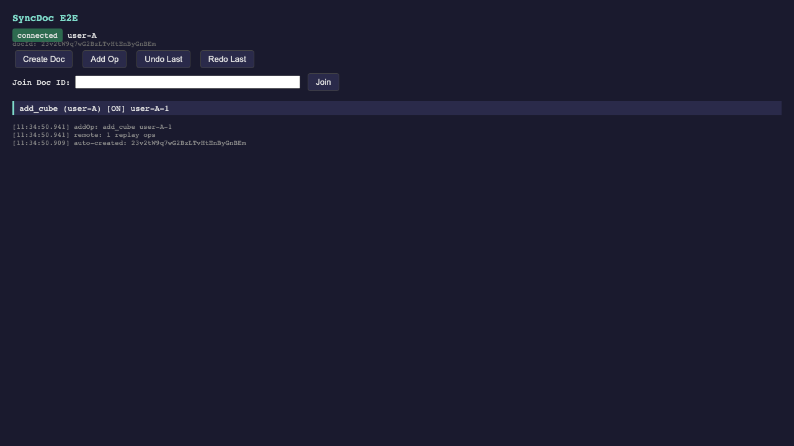
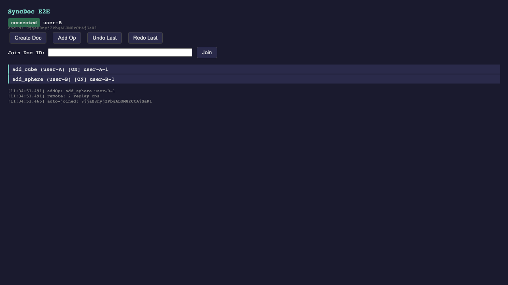
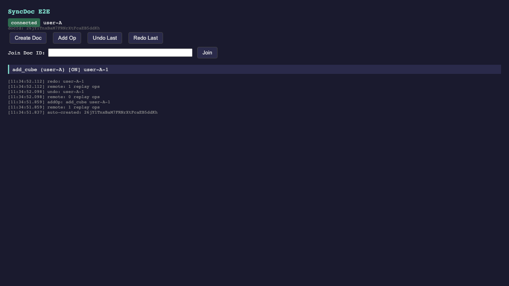
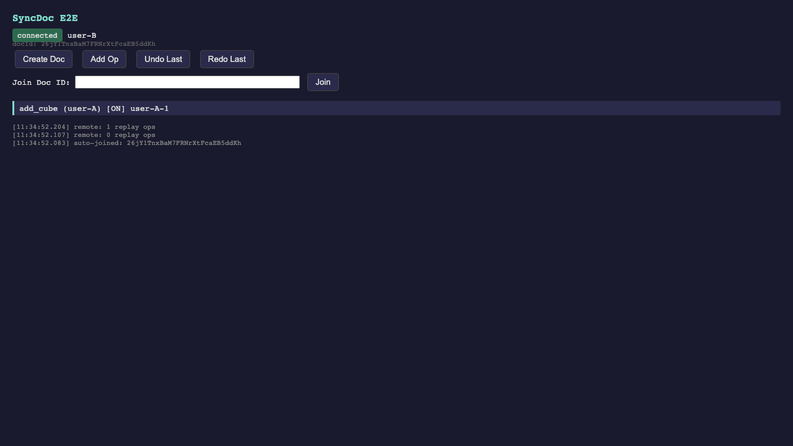
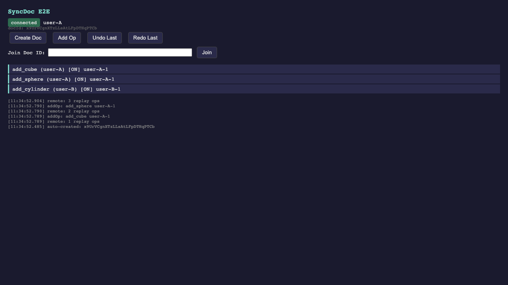
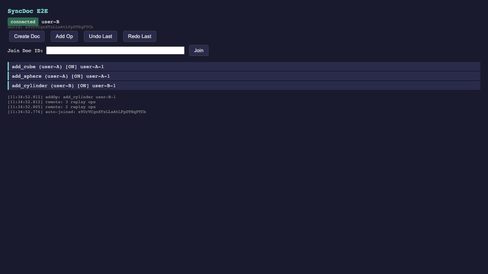

# systems/sync — CRDT Op Log + PartyKit Sync

Reusable, plugin-agnostic CRDT operation log with real-time sync via PartyKit.
Knows nothing about CAD geometry, replay, or any specific system — it stores, merges, and syncs ordered operations using Automerge CRDTs over Durable Objects.

**Everything is tested for real.** No mocks, no fakes. Real Cloudflare Workers runtime, real Durable Objects, real automerge-repo protocol, real browsers (Playwright).

## The Stack

```
┌─────────────┐     ┌──────────────────────┐     ┌─────────────┐
│  Browser A   │     │   Cloudflare Worker   │     │  Browser B   │
│              │     │                      │     │              │
│  SyncDoc     │ WS  │  Hono + hono-party   │ WS  │  SyncDoc     │
│  automerge-  │◄──►│                      │◄──►│  automerge-  │
│  repo        │     │  ┌────────────────┐  │     │  repo        │
│              │     │  │ Durable Object │  │     │              │
│  ops (CRDT)  │     │  │ AutomergeServer│  │     │  ops (CRDT)  │
└─────────────┘     │  │ DO Storage     │  │     └─────────────┘
                     │  └────────────────┘  │
                     └──────────────────────┘
```

| Layer | Package | What it does |
|-------|---------|-------------|
| **SyncDoc** | `@plat/sync/partykit` | Typed op-log API: addOp, undo, redo, group, replay |
| **automerge-partyserver** | `.tgz` from fork | Automerge sync in Durable Objects (128KB chunking, per-peer state) |
| **automerge-repo** | `@automerge/automerge-repo` | Incremental CRDT sync protocol, DocHandle lifecycle |
| **Hono + hono-party** | `hono` + `hono-party` | HTTP routing + PartyKit-style WebSocket routing |
| **partyserver** | `partyserver` | Durable Object base class with WebSocket management |

## Routes (3 Durable Objects)

Each feature gets its own DO class and route — tested independently:

| Route | DO Class | What it tests |
|-------|----------|--------------|
| `/parties/sync/:room` | `Sync` | Raw Automerge transport — connect, handshake, sync, two-peer convergence |
| `/parties/ops/:room` | `Ops` | SyncDoc operations — add, undo, redo, group undo/redo, model name, replay |
| `/parties/presence/:room` | `Presence` | Ephemeral broadcast — cursor position, selection (not persisted) |

Plus HTTP endpoints:
- `GET /health` — health check
- `GET /api/status` — list all routes

## Quick Start

### SyncDoc (client API)

```typescript
import { SyncDoc } from '@plat/sync/partykit';

// Peer A creates a doc
const syncA = new SyncDoc({ host: 'localhost:1999', room: 'my-model', actorId: 'user-1' });
const docId = await syncA.create();

syncA.addOp({ id: '1', type: 'add_cube', params: { size: 1 }, enabled: true, timestamp: Date.now(), actorId: 'user-1' });
syncA.undo('1');       // disable op
syncA.redo('1');       // re-enable

// Peer B joins the same doc
const syncB = new SyncDoc({ host: 'localhost:1999', room: 'my-model', actorId: 'user-2' });
await syncB.join(docId);

// B sees A's ops automatically via automerge-repo CRDT sync
syncB.onRemoteOps = (ops) => replayScene(ops);
```

### Server (wrangler dev)

```bash
cd systems/sync && mise run dev
# → wrangler dev on :1999 with 3 Durable Objects
```

### Test GUI (manual testing)

```bash
mise run dev:gui
# → wrangler on :1999 + Vite GUI on :5199
# → open http://localhost:5199/e2e-index.html?room=my-room&actor=user-1
# → open another tab with ?actor=user-2&docId=<id-from-first-tab>
```

## Tests — 26 total, all real

```bash
cd systems/sync

mise run test              # ALL: Rust + Node + Playwright
mise run test:rust         # 24 Rust CRDT tests
mise run test:partykit     # 22 Node tests (wrangler + 6 DOs)
mise run test:e2e          # 4 Playwright browser tests
```

### Test matrix

| File | Route | Runtime | Tests | What |
|------|-------|---------|-------|------|
| `sync.test.ts` | `/parties/sync` | Node + wrangler DO | 4 | automerge-repo transport: connect, handshake, sync, converge |
| `sync-doc.test.ts` | `/parties/ops` | Node + wrangler DO | 8 | SyncDoc: add, undo, redo, group, name, two-peer convergence, replay |
| `presence.test.ts` | `/parties/presence` | Node + wrangler DO | 3 | Ephemeral broadcast: HTTP status, 2-peer, 3-peer |
| `pubsub.test.ts` | `/parties/pub-sub` | Node + wrangler DO | 2 | partysub: topic subscribe, topic filtering |
| `rpc.test.ts` | `/parties/rpc` | Node + wrangler DO | 4 | partyfn: echo, add, greet, error handling |
| `scheduler.test.ts` | `/parties/scheduler` | Node + wrangler DO | 1 | partywhen: DO routable (fails — see known issues) |
| `e2e/specs/sync-e2e.spec.ts` | `/parties/ops` | Chromium (Playwright) | 4 | Real browser: add op, two-peer converge, undo/redo sync, multi-op |
| `crate/src/lib.rs` | — | Rust native | 24 | CRDT math: merge, dedup, replay, rollback, Blake3 |

**No mocks.** Every test runs against real wrangler with real Durable Objects. Playwright tests run in real Chromium with real WebSocket connections.

## Package exports

| Import | What |
|--------|------|
| `@plat/sync/partykit` | `SyncDoc`, `SyncDocOptions`, `SyncDocData` |
| `@plat/sync/types` | `Operation` type |
| `@plat/sync/wasm-adapter` | `SyncWasmAdapter` interface (optional — for validation/replay) |

## Directory layout

```
systems/sync/
  crate/                  Rust WASM (Automerge CRDT, Blake3 — optional)
  pkg/                    WASM build output (web + bundler targets)
  ts/
    partykit/
      sync-doc.ts           SyncDoc class — the main API
      index.ts              exports
    shared/
      types.ts              Operation type (generated from Rust)
      wasm-adapter.ts       SyncWasmAdapter interface
  test/partykit/
    worker.ts               Hono + hono-party + 3 DO classes (Sync, Ops, Presence)
    wrangler.toml           DO bindings + dev port
    polyfill.ts             FinalizationRegistry polyfill for miniflare
    sync.test.ts            Transport tests (automerge-repo protocol)
    sync-doc.test.ts        SyncDoc E2E tests (ops over PartyKit)
    presence.test.ts        Ephemeral broadcast tests
    e2e-index.html          Test GUI for Playwright + manual testing
    e2e-main.ts             GUI entry point (SyncDoc + op list UI)
    e2e/
      playwright.config.ts  Playwright config (auto-starts wrangler + vite)
      vite.config.ts        Vite config for test GUI
      specs/
        sync-e2e.spec.ts    Browser E2E tests
  mise.toml                 All tasks (build, test, dev)
  package.json              @plat/sync exports
  system.mjs                Root pipeline config
```

## Build

```bash
cd systems/sync

# WASM (only needed if using validation/replay)
mise run build:wasm:self

# automerge-partyserver fork package
mise run partyserver:build     # → .packages/automerge-partyserver-0.1.0.tgz
mise run partyserver:install   # → installed in test/partykit/
```

## automerge-partyserver fork

The `automerge-partyserver` package is built from the fork at [`joeblew999/partykit`](https://github.com/joeblew999/partykit/tree/feat/automerge-partyserver). Not yet on npm — installed as a `.tgz` from `.packages/`.

Upstream issue: [cloudflare/partykit#361](https://github.com/cloudflare/partykit/issues/361)

```bash
mise run partyserver:build    # Build fork → .tgz
mise run partyserver:install  # Install .tgz in test/partykit
```

The fork provides:
- `withAutomerge(Server)` mixin — automerge-repo sync in Durable Objects
- `DOStorageAdapter` — DO storage with 128KB chunking
- `AutomergeProvider` — browser client with IndexedDB + BroadcastChannel

When published to npm: replace `.tgz` with `bun add automerge-partyserver`.

## WASM Size

Two WASM modules in the stack:

### @automerge/automerge (required — used by automerge-repo in browser + DO)

| Target | Raw | Gzipped | Where |
|--------|-----|---------|-------|
| web (browser) | 2.7 MB | 897 KB | Browser — loaded by SyncDoc via automerge-repo |
| workerd (DO) | 2.7 MB | 897 KB | Durable Object — loaded by AutomergeServer |

This is the upstream Automerge WASM. We don't build it — it ships with `@automerge/automerge` npm.

### plat-sync (optional — our Rust crate for validation/replay)

| Target | Raw | Gzipped | Where |
|--------|-----|---------|-------|
| web (browser ESM) | 1.1 MB | 362 KB | Browser — only if consumer needs op validation/Blake3 |
| bundler (CF Worker) | 1.1 MB | 362 KB | Worker — only if consumer needs server-side replay |

Build profile: `opt-level=z`, LTO, single codegen unit, strip symbols. SyncDoc does NOT require this — it's for truck-cad's headless replay.

## Screenshots

Captured by Playwright during `mise run test:e2e`. Real Chromium, real WebSocket, real Durable Objects.

### Single peer adds an op


### Two peers converge — both see both ops
| Peer A | Peer B |
|--------|--------|
|  |  |

### Undo/redo syncs between peers
| Peer A (after redo) | Peer B (sees A's redo) |
|---------------------|------------------------|
|  |  |

### Multiple ops from both peers converge
| Peer A (3 ops) | Peer B (3 ops) |
|-----------------|----------------|
|  |  |

## Known Issues

| Package | Issue | Status |
|---------|-------|--------|
| **partywhen** | Scheduler SQL init crashes in miniflare local dev (`ctx.storage.sql` in constructor) | `it.fails` test documents it |
| **partysession** | Published to npm but has no code (empty `dist/`) | Cannot test — package is a placeholder |
| **automerge-repo** | `FinalizationRegistry` not available in miniflare — needs polyfill | Polyfilled in `polyfill.ts` |
| **@automerge/automerge** | `/slim` conditional export not resolved by Vite/rolldown | Aliased in `e2e/vite.config.ts` |
| **@automerge/automerge** | Browser needs `initializeWasm()` before use | Called in `e2e-main.ts` |

## What's next

- [ ] Switch truck-cad from SyncClient → SyncDoc
- [ ] File upstream PR to partykit/partykit (PARTYKIT-ISSUE.md is ready)
- [ ] Publish automerge-partyserver to npm
- [ ] Add partysub (topic-based pub/sub) tests
- [ ] Add partysession (per-user state) tests
- [ ] Browser E2E: cross-tab BroadcastChannel test
- [ ] Browser E2E: offline/reconnect test
